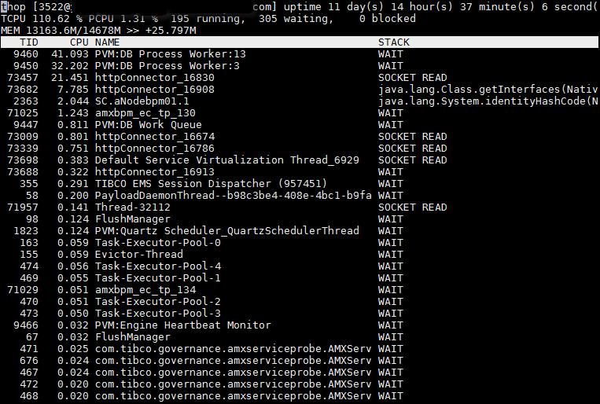

Thop - Java Thread Top
======================

Thop is a Java thread monitoring tool similar to the UNIX utility top. It lists the top CPU thread usage and the current stack traces and threads that are blocked.

I've made this tool to understand what the JVM is doing and what it is waiting for. My stuff (especially in production) is always behind multiples VPNs so X (visualvm) is not an option. It uses the  [Lanterna](https://github.com/mabe02/lanterna) pure java library as ssh friendly terminal UI. There are still issues with slow terminals and I  am waiting for the final 3.0 version of lanterna before addressing them.

Use the 's' key to obtain of full thread dump (snapshot) of the JVM to enable full stack trace browse. The stack will not be updated until the user hit 'ESC'.

Usage
-----
Lanterna and tools.jar (from the jdk lib directory) needs to be on the classpath. Set "thop" bash script in the root directory.

./thop [pid]

You can also use thstat that shows up the thread activity on stdout. Useful if you want to log Java thread activity without the interactive interface.

./thstat [pid] > activity.log

Screenshot
----------

Key bindings 
------------
* c - config settings dialog
* h - brings the help page
* q - quits the application
* s - gets a full thread dump (snapshot) and browse interactively into this dump by using the arrow keys

Todo
----
* Custom gradle startup script to make a out of the box dist and remove tools.jar from the distribution
* Make scrolling available in refresh (non snapshot) mode (mix of full snapshots and dynamic snapshots)
* Understand why with OperatingSystemMXBean.getProcessCpuLoad() I get very different readings on different servers

